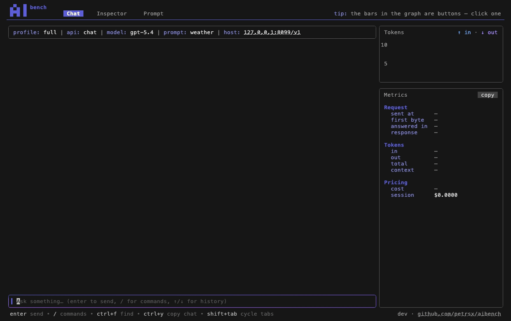
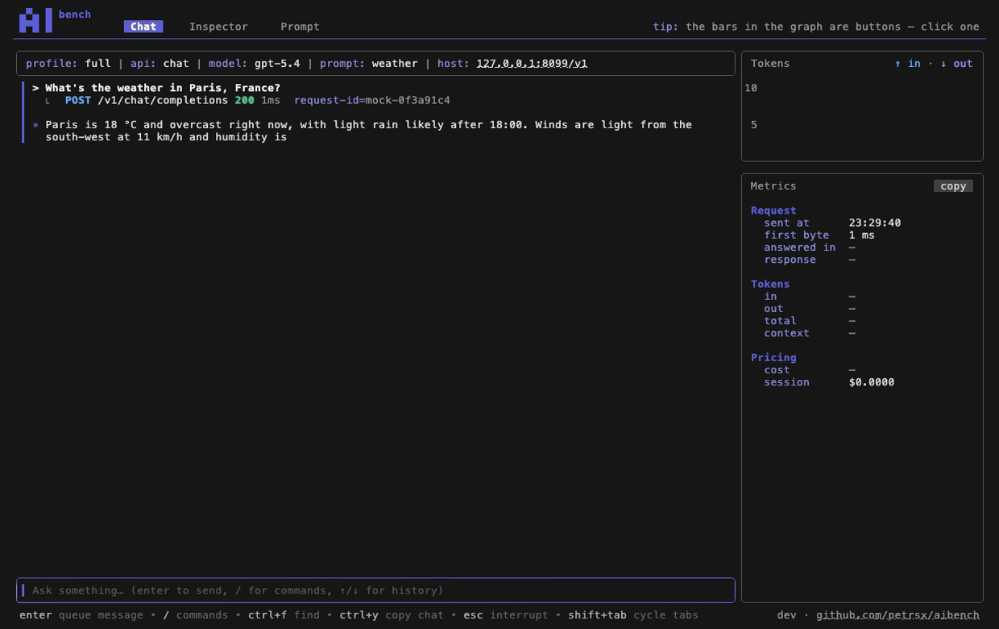

# 

A terminal app for **prompt engineering and testing AI endpoints** —
OpenAI and Anthropic APIs, direct or behind gateways (APIM), including
Azure/Foundry model deployments and hosted agents.

It is a bench, not a chat client. You send a message to find out what the
endpoint *did* with it — how long it took, what actually went on the
wire, what it cost — so the answer and the evidence stay on screen
together.



Every request leaves a **record line** under the message — route, status,
latency, tokens. Click one and the panels measure that request instead.
A single question can take several requests (a tool loop, a retry), so
the gutter marks both: a light rule spans the whole exchange, a heavy one
the request you are looking at.

## What it does

**Reads the wire, not a summary of it.** The Inspector holds the raw
request and response for whichever record you pinned — URL, headers
(secrets redacted), the body as sent and as received.



**Replays a conversation exactly.** A starter script is a list of prompts
sent in order, each after the previous reply — the repeatable unit for
testing a prompt change. Launch *offers* the selection when a prompt set
declares one; nothing ever auto-sends.

**Switches the two axes independently.** A profile is an endpoint; a
prompt set is what you send with it. `/profiles` swaps the endpoint and
keeps the prompt, so the same instructions can run against a small model
and a large one, two api versions, or direct and through a gateway.

**Measures what it cost.** The Metrics panel reports latency, tokens,
context share, and price per request and per session — the last from a
pricing table you can override with your own deployment names.

**[docs/using-aibench.md](docs/using-aibench.md) is the guided tour** —
the three tabs, records and exchanges, commands, keys.

## Install

**Package manager.** macOS / Linux (Homebrew):

```sh
brew install --cask petrsx/tap/aibench
```

Windows (winget):

```sh
winget install petrsx.aibench
```

**A binary.** Every release on the
[releases page](https://github.com/petrsx/aibench/releases) has an archive
per platform — macOS and Linux as `.tar.gz`, Windows as `.zip`, both amd64
and arm64. Unpack it, put `aibench` somewhere on your `PATH`, and check it
answers `aibench --version`.

**With Go**, if you already have the toolchain:

```sh
go install github.com/petrsx/aibench@latest
```

To build from a checkout, see [CONTRIBUTING.md](CONTRIBUTING.md).

## First run

Just run `aibench`. On a fresh install it writes a starter config to `~/.aibench/aibench.yaml` (`%USERPROFILE%\.aibench\` on
Windows), tells you what to fill in, and exits. Open it — `aibench
profiles edit` does that — add an endpoint and a credentials file, and
run again. [`examples/`](examples/) has profiles you can copy in and a
complete prompt set to start from.

If you would rather keep the config with a project, put it at
`./aibench.yaml` or `./.aibench/aibench.yaml`; either one wins over the
home copy. Any other path works with `--config <file>`.

## Configuration

Profiles live in `aibench.yaml`; credentials live in env files the
profile names — never in the yaml.

```yaml
# yaml-language-server: $schema=https://raw.githubusercontent.com/petrsx/aibench/main/schema/aibench.schema.json
prompts:
  weather:                   # a prompt set: what you're testing (a profile pins one)
    instructions: prompt.md  # system prompt (markdown + frontmatter params)
    starters:                # 0..n scripts; launch offers /starters, nothing auto-sends
      - prompt.starters.md

profiles:
  dev:
    kind: model              # model | agent — always declared
    api:
      provider: openai       # openai | anthropic
      base: https://your-endpoint.example.com/v1
      model: gpt-5.4-mini
    auth:
      credentials: .env      # env-format file with only the needed secrets
    prompt: weather          # optional pin: the set this profile starts on
```

Every key is checked, so a misspelled one gets an error naming it. The
file is live-reloaded while the app runs. It is yours alone; the little
the app remembers between runs goes into a `settings.json` beside it.

## Docs

| | |
| --- | --- |
| [Using aibench](docs/using-aibench.md) | the app itself: tabs, records, commands, keys |
| [Configuration](docs/configuration.md) | `aibench.yaml`, group by group — start at Common setups |
| [Authentication](docs/authentication.md) | API keys, gateway headers, Entra ID, and what the failures mean |
| [Prompts](docs/prompts.md) | the prompt file: params per api, starter scripts, hot reload |
| [Tools](docs/tool-catalog.md) | declaring tools and executing them (http, static, mcp) |
| [Pricing](docs/pricing.md) | model rates behind the cost rows |
| [Command line](docs/cli.md) | `aibench send` and the other commands that work without the TUI |

## Built with

[Bubble Tea](https://github.com/charmbracelet/bubbletea) drives the app,
with [Bubbles](https://github.com/charmbracelet/bubbles) for the viewports
and inputs, [Lipgloss](https://github.com/charmbracelet/lipgloss) for
every style and layout, and [Glamour](https://github.com/charmbracelet/glamour)
for the rendered prompt. The gifs above were recorded with
[VHS](https://github.com/charmbracelet/vhs), and the pricing table comes
from [catwalk](https://github.com/charmbracelet/catwalk).

## Developing

[CONTRIBUTING.md](CONTRIBUTING.md) covers building from source, the test
tiers, and the roadmap. For how any one package works, read the package:
its doc comments are the reference, and they live beside the code.

## License

aibench is released under the [MIT license](LICENSE): use it, change
it, ship it, inside a company or not. Keep the copyright line and the
license text with any copy.

Copyright (C) 2026 Petr Stupka.
