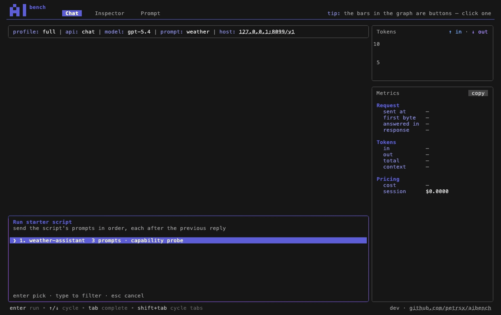

# Using aibench

A tour of the app itself — what is on the screen, and what each part
answers. The other guides cover setting aibench up —
[configuration](configuration.md), [authentication](authentication.md),
[prompts](prompts.md), [tools](tool-catalog.md) — while this one assumes
you have a working profile and are looking at the app.

The short version: **aibench is a bench, not a chat client.** You send a
message to see what the endpoint does with it — how long it took, what
went on the wire, what it cost — and the layout is built around that
question rather than around the conversation.

## Your first send

Run `aibench`, type into the composer at the bottom, press `enter`.

The reply streams in above. While it streams, `esc` interrupts it — and
typing another message does not lose it: **`enter` queues it** and sends
it when the current reply finishes. Queued messages show as dim `>` rows
so you can read back what is waiting.

Under the question you will see a line like:

```
  ⎿  POST /v1/chat/completions 200 1.4s  645 tokens (↑412 · ↓233)
```

That is the **record line**: one request, and what it cost. It is the
row the rest of the app is organised around.

## Records and exchanges

One question is not always one request. Ask something that makes the
model call a tool, and answering you takes several round trips — each
one its own record.

aibench keeps both readings visible in the left gutter:

| Gutter | Means |
| --- | --- |
| `│` light rule | the **exchange** — every request it took to answer this one question |
| `┃` heavy rule | the single **record** the panels on the right are showing |

So the light rule spans the whole question-and-answer, and the heavy
rule marks which request inside it you are currently measuring.

**Click any row** of a block to pin its record — the question, the
reply, or the record line itself. The panels follow. Click again to
unpin and go back to following the newest. `shift+↑` / `shift+↓` walk
the records without reaching for the mouse, and `ctrl+end` returns to
the latest.

Tool calls appear inside the reply that asked for them:

```
● search_locations({"text":"Paris"})
  ⎿  POST /v1/chat/completions · 200 · 0.9s
  ⎿  search_locations ▸ 200 items · 24 kB · click to expand
```

The call and the request it cost always show — that is what happened.
Only the **payload** folds; click `click to expand` to read it.

`ctrl+d` hides the record lines entirely, leaving just the
conversation, for when you want to read rather than measure.

## The three tabs

`shift+tab` cycles them, or click a tab label.

| Tab | Answers |
| --- | --- |
| **Chat** | what was said, and what each turn cost |
| **Inspector** | what actually went on the wire |
| **Prompt** | what is being sent *with* every message |

They all show the **same pinned record**. Pin a request in Chat, flip to
Inspector, and you are looking at that request's bytes.

### Chat

The transcript on the left, two panels on the right.

**Tokens** graph — a pair of bars per record, input beside output,
**newest on the left**. The bars are buttons: click one to pin that
record.

**Metrics** — the pinned record in detail:

| Group | Rows |
| --- | --- |
| Request | `sent at`, `first byte`, `answered in`, `response` (bytes back) |
| Tokens | `in`, `out`, `total`, `context` (share of the model's window) |
| Pricing | `cost` for this request, `session` for everything so far |
| Error / Interrupted | only when something went wrong, or you pressed `esc` |
| Rate limits | only when the endpoint sent rate-limit headers |

The title says `Request (exchange 2 of 3)` when the question took more
than one request — the same thing the two gutter rules are telling you.

Pricing rows need a model the pricing table knows; see
[pricing](pricing.md) if they read `–`.

### Inspector

The raw HTTP exchange, nothing rendered away.

`tab` flips between **Request** (the URL, the headers sent, the body
sent) and **Response** (status, headers, body). `ctrl+r` flips the body
between the wire form and its decoding — useful when a field holds
escaped JSON or newlines and you want to read what it *says* rather
than what was literally sent.

On the right: **Headers** for the exchange, and **Request** — a size
breakdown of what you sent, message by message, so an over-long history
is visible rather than inferred.

`ctrl+y` copies the whole body as received.

### Prompt

What rides along with every message: the rendered system prompt on the
left, the **Params** panel on the right.

Params come from the prompt file's frontmatter, and which ones exist
depends on the api — `temperature` and `top_p` almost everywhere,
`reasoning_effort` and `verbosity` on the OpenAI wires, `top_k` on
Messages. A param you leave unset stays out of the request, so the
model's own default applies. `tab` moves between fields; edits auto-save
back to the file.

Edit the prompt file in your editor and the tab **reloads as you
save**; the next send uses it. `ctrl+y` copies the prompt as markdown,
the way the file holds it.

## Commands

Type **`/`** in the composer. The menu filters as you type: `↑`/`↓`
cycle, `tab` completes, `enter` runs.

| Command | Does |
| --- | --- |
| `/clear` | flush the conversation |
| `/help` | the always-current key sheet (`tab` flips to Settings) |
| `/init` | scaffold `./.aibench` — profiles and prompts scoped to this folder |
| `/pricing-edit` | open `pricing.yaml` in your editor, for a row no registry has |
| `/pricing-update` | refresh `pricing.yaml` from catwalk; the cost rows reprice at once |
| `/profiles` | switch endpoint — clears the conversation, since a different prompt takes over |
| `/profiles-edit` | open `aibench.yaml` in your editor |
| `/settings` | theme, editor, startup profile, update check, autosave |
| `/starters` | play a scripted conversation from the prompt set |
| `/exit` | leave the app (so does typing the bare word `exit`, or `ctrl+c`) |

`/profiles` and `/starters` turn the composer itself into a selector —
the frame fills with options and typing filters them. No dialog boxes
anywhere.

## Starter scripts

A starter script is a conversation worth repeating: a list of prompts,
sent in order, each after the previous reply came back.

Declare them in a prompt set and launch **offers** the selection —
`/starters` opens the same list any time. **Nothing ever auto-sends**;
you pick, and `esc` backs out. `esc` mid-run stops the script.



A conversation worth having twice belongs in a starter script, which
replays it exactly. That is why the conversation itself lives only for
the session: the script is the repeatable thing. See
[prompts](prompts.md#starter-scripts).

## Finding, selecting, copying

`ctrl+f` opens find on whichever pane is in front. `enter` or `ctrl+n`
goes to the next match, `ctrl+p` the previous, `esc` closes. The ▲/▼
icons in the overlay do the same with the mouse.

Drag to select text in any pane; releasing copies it. `ctrl+y` copies
the whole pane — the transcript in Chat, the body in Inspector, the
prompt in Prompt. Panels with a `copy` control in their corner copy on
click.

## Keys

`/help` always shows the live sheet for the tab you are on. The chords
are deliberately few — everything else is a slash command.

| Keys | Does |
| --- | --- |
| `enter` | send — or queue, while a reply streams |
| `shift+enter` · `alt+enter` | newline |
| `/` | command menu |
| `↑` `↓` | input history (starter prompts seed it) |
| `shift+↑` `shift+↓` | walk records · `ctrl+end` back to latest |
| `shift+tab` | cycle tabs |
| `ctrl+f` | find |
| `ctrl+y` | copy the pane |
| `ctrl+d` | hide/show the record lines (Chat) |
| `tab` | Request/Response (Inspector) · next field (Prompt) |
| `ctrl+r` | raw/rendered body (Inspector) |
| `pgup` `pgdn` | scroll |
| `esc` | close find, interrupt a streaming reply, or stop a script |
| `ctrl+c` · `exit` | quit |

## Without the TUI

Everything the app sends, `aibench send` sends the same way — same
profile, same prompt pair, same params — for smoke-testing a profile or
scripting a check:

```console
$ aibench send "what is the capital of France"
$ echo "summarise this" | aibench send
$ aibench send --script            # play the prompt set's starters
```

The full surface is [the command line](cli.md).
